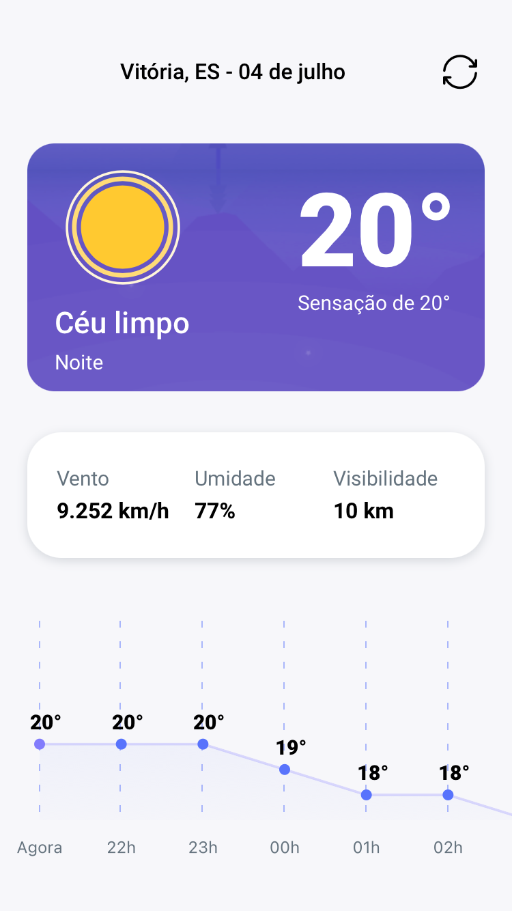

<h1 align="center">
   ClimaBuilder
</h1>
<h1 align="center">
    
</h1>
 <p align="center">Previsão do tempo na palma da sua mão.</p>
<p align="center">
  <a href="https://jobs.kenoby.com/sejabuilder">
    
  </a>

</p>

<br>

## 📱 Telas do projeto

<p align="center">
  
   
</p>

## 🚀 Tecnologias

Tecnologias utilizadas:

- [React Native v0.64](https://facebook.github.io/react-native/)
- [TypeScript](https://www.typescriptlang.org/)
- [React Navigation](https://reactnavigation.org/)
- [Styled Components](https://styled-components.com/)
- [Moment](https://momentjs.com/)
- [Yarn](https://expo.io/)
- [Geolocation](https://github.com/react-native-geolocation/react-native-geolocation)
- [Chart Kit](https://github.com/indiespirit/react-native-chart-kit)
- [Lottie](https://github.com/lottie-react-native/lottie-react-native)
- [Axios](https://github.com/axios/axios)
- [API OpenWeatherMap](https://openweathermap.org/)
- [ESLint](https://eslint.org/)
- [Prettier](https://prettier.io/)

### 💻 Installation

```bash
# Clone este repositório
$ git clone https://github.com/meycon/climabuilder.git

# Vá para o repositório
$ cd climabuilder

# Instale dependências
$ yarn

# IOS
$ cd ios/
$ pod install
$ cd ..
$ yarn ios

# Android
$ yarn android

```

## 📝 Licença

Esse projeto está sob a licença MIT. Veja o arquivo [LICENSE](LICENSE) para mais detalhes.

---

Desenvolvido por Meycon Augusto. 📲 💻
